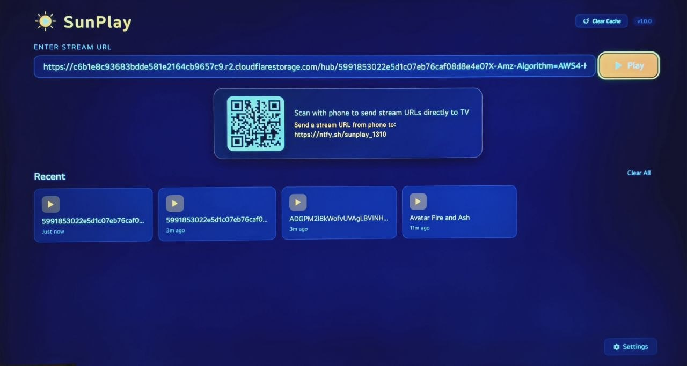
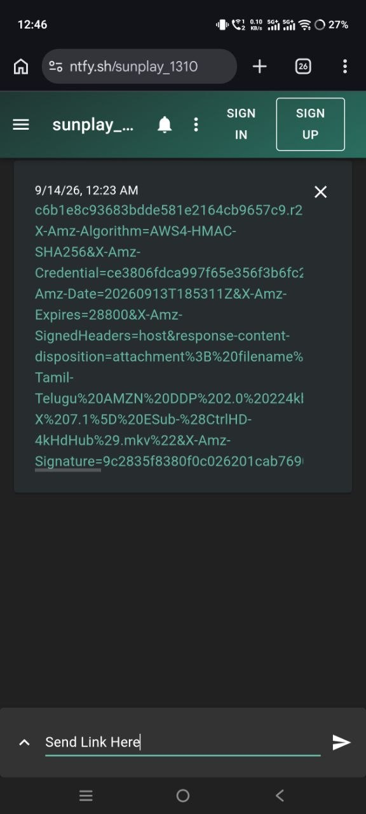
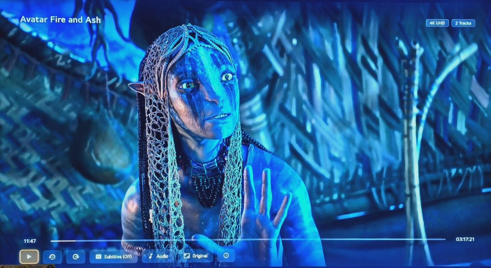

# SunPlay

[](https://github.com/Sundeeppazhoor/SunPlay/releases/latest)
[](https://github.com/Sundeeppazhoor)
[](LICENSE)

Pure native media player and streaming application for **LG webOS TV**, engineered for zero-copy hardware video decoding, container header probing, and low-memory performance on 4K HDR Remux streams.

> [!WARNING]
> **Beta Stage Notice**: SunPlay is currently in active **Beta** development. While the core video player and streaming engine are fully functional, you may encounter edge cases or bugs with certain rare container profiles or specific TV models. Active updates and refinements are ongoing.

> [!IMPORTANT]
> **Memory & Stability Tip (Clear Cache Regularly)**:
> LG TVs have limited shared system RAM (typically 1 GB to 1.5 GB for the entire operating system, apps, and hardware video buffers).
> - When playing large 4K streams or 20 GB – 70 GB Remux files, webOS can display *"The app will restart to free up memory"* if memory becomes constrained.
> - **Recommendation**: Go to the **Settings** tab in SunPlay and click **Clear Cache** periodically (especially before playing massive 4K files) to ensure maximum available memory for the hardware video decoder.
> - Ensure background TV apps (like Netflix, YouTube, or web browser) are closed before launching heavy 4K streams.

---

## 📸 Screenshots & Interface

| Home Screen & Instant QR Pairing | Send URL from Mobile Phone | In-Video Player HUD & Controls |
| :---: | :---: | :---: |
|  |  |  |

---

## 🏆 Credits & Acknowledgments

The native media engine foundations and player architecture of **SunPlay** are inspired by and adapted from the open-source media player project [nuvio-native-legacy](https://github.com/iqui27/nuvio-native-legacy) by **iqui27**.

We express our sincere appreciation and credit to:
- **iqui27** ([@iqui27](https://github.com/iqui27)) for architecting `nuvio-native-legacy` and pioneering native webOS uMS & libAcbAPI media plane integration.
- The open-source LG webOS development community.

All original underlying player routines, video subsystem integrations, and native Luna Service bus bindings remain the intellectual property and creation of their respective authors under their original open-source licenses.

---

## 🚀 How to Stream Easily (New User Guide)

Streaming video on your LG TV with SunPlay takes only a few seconds:

### Step 1: Open SunPlay on your LG TV
Launch SunPlay from your TV home dashboard or apps menu.

### Step 2: Send or Enter Your Stream URL
You have three convenient ways to load a stream:
- **Option A — Scan QR Code from Phone (Recommended)**:
  1. SunPlay displays a dynamic QR code and pairing link directly on the home screen.
  2. Simply scan the QR code with your smartphone camera (or open the displayed link in any phone/PC browser).
  3. Paste your video streaming link and send it.
  4. The URL immediately appears in SunPlay on your TV and readies the **Play** button!
- **Option B — Direct Remote Control Entry**:
  1. Click the text box on your TV screen using the LG Magic Remote cursor.
  2. Type or paste your video link and click **"Play"**.
- **Option C — Watch History**:
  1. Previously played links are automatically saved in the **Recent History** section.
  2. Click any history item to choose **Resume** (from where you left off) or **Start from Beginning**.

### Step 3: Use On-Screen Remote Controls
While the video is playing, press **Enter / OK** or any D-pad arrow on your Magic Remote to reveal the on-screen display (OSD):
- **Audio Tracks**: Switch between embedded audio streams (Hindi, English, Tamil, Telugu, 5.1 / 7.1 surround sound).
- **Subtitles**: Select embedded subtitle tracks or search millions of subtitles live via the **OpenSubtitles** search dialog.
- **Subtitle Styling**: Live adjustment of subtitle font size (Small to Extra Large), colors (White, Yellow, Cyan, Green), background box, and millisecond delay sync.
- **Aspect Ratio**: Cycle between Original, 16:9 Stretch, 1.15x Zoom, and Fullscreen Crop.
- **Seek / Jump**: Instant debounced 10-second jumps using Left / Right D-pad arrows or dedicated OSD buttons.
- **Exit**: A single press of the remote's **Back** button safely closes the player and returns you to the home menu.

---

## 📦 Installing SunPlay on Your LG TV

1. Download the latest ready-to-run `.ipk` package directly from **[GitHub Releases](https://github.com/Sundeeppazhoor/SunPlay/releases/latest)** (e.g. `com.sunplay.native_1.0.0_all.ipk`).
2. Install it on your LG TV using your preferred installation app on Windows, macOS, or Mobile (Android).

For detailed instructions and official guides:
- **Official LG webOS Developer Guide**: [Installing webOS TV Apps](https://webostv.developer.lge.com/develop/getting-started/app-install)
- **webOS Dev Manager (Windows / Mac / Linux GUI)**: [webOS Dev Manager Downloads & Guide](https://github.com/webosbrew/dev-manager)
- **webOS Dev Manager (Mobile / Android)**: Install `.ipk` packages directly over Wi-Fi from your smartphone.

---

## 🛠️ Building & Packaging the App

To re-package the app after editing code:

1. Run the build script or packager on Windows:
   ```cmd
   package.bat
   ```
   Or using Node.js:
   ```cmd
   node package.js
   ```
2. The package will be created in `dist/com.sunplay.native_1.0.0_all.ipk`.

---

## ✨ Key Features & Architecture

1. **Hardware Video Acceleration**:
   - Zero-copy hardware decoding for **4K Ultra HD, 1080p, HEVC (H.265), H.264, VP9, AV1, HDR10, and Dolby Vision**.
   - Direct memory-safe streaming buffers to prevent TV out-of-memory restarts.

2. **Container Header Probing (MKV / MP4)**:
   - Probes the first 384 KB of media headers (`Range: bytes=0-393215`) to read EBML TrackEntry data.
   - Accurately identifies all embedded subtitle tracks (`S_TEXT/UTF8`, `S_TEXT/ASS`, `S_HDMV/PGS`) and audio streams (`A_EAC3`, `A_DTS`, `A_AAC`, `A_AC3`) even when standard TV demuxers skip them.

3. **Multi-Audio Track Selection**:
   - Real-time selection of audio tracks (Hindi, Tamil, Telugu, English, etc.).

4. **Dual Subtitle Engine**:
   - Embedded subtitle track detection.
   - Built-in live OpenSubtitles v3 title search (search by movie name or series).
   - High-contrast text overlay with customizable font size, colors, background boxes, and millisecond delay sync.
   - Automatic handling for BluRay PGS bitmap streams (alerts user and switches to matching text subtitles).

5. **Smooth Magic Remote Control**:
   - Full D-pad and Magic Remote pointer support.
   - Auto-resume progress tracking.
